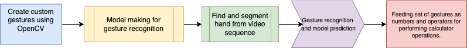

# CSE455

You can use the [editor on GitHub](https://github.com/djramakrishna/cvtest.github.io/edit/gh-pages/index.md) to maintain and preview the content for your website in Markdown files.

<!-- Whenever you commit to this repository, GitHub Pages will run [Jekyll](https://jekyllrb.com/) to rebuild the pages in your site, from the content in your Markdown files. -->

## Gesture-controlled-opencv-calculator

### Introduction
Gestures play an important role in our everyday communication and expression. Thus using them to communicate with tech devices needs very little intellectual data processing from our side. That means we can control different things such as vending machines almost without thinking, just by using our fingers and hands. Gesture recognition is a technology aimed at providing live-time data to a computer to execute commands the user wants. People do not need to type anything with keys or tap on a touch screen to perform a specific action. The device's motion sensor can perceive and interpret the person's movements as the primary source of data input The scope of the project is to construct a synchronous gesture classifying system that can recognize gestures in lighting circumstances spontaneously. To achieve this goal, a synchronous gesture which based on real time is generated to recognize gestures. An intention of this project is to generate a complete system which can identify, spot and explain the hand motioning through computer sight. This structure will work as one of the envisioning of computer sight and AI with user interaction. It create function to identify hand motion based on various arguments. The topmost preference of the structure is to make it easy to use, simple to handle and user amiable without producing any specific hardware. All functions will appear on same Computer or workstation. Only some specific hardware will be used to digitalize the picture.

<!-- [LinkedIn]([https://www.linkedin.com/in/ramakr1shna) -->

## Project Flow


## Creating custom gestures using OpenCV




### Markdown

Markdown is a lightweight and easy-to-use syntax for styling your writing. It includes conventions for

```markdown
Syntax highlighted code block

# Header 1
## Header 2
### Header 3

- Bulleted
- List

1. Numbered
2. List

**Bold** and _Italic_ and `Code` text

  and 
```

<!-- For more details see [Basic writing and formatting syntax](https://docs.github.com/en/github/writing-on-github/getting-started-with-writing-and-formatting-on-github/basic-writing-and-formatting-syntax).

### Jekyll Themes

Your Pages site will use the layout and styles from the Jekyll theme you have selected in your [repository settings](https://github.com/djramakrishna/cvtest.github.io/settings/pages). The name of this theme is saved in the Jekyll `_config.yml` configuration file.

### Support or Contact

Having trouble with Pages? Check out our [documentation](https://docs.github.com/categories/github-pages-basics/) or [contact support](https://support.github.com/contact) and we’ll help you sort it out. -->
